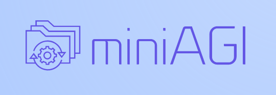

# miniAGI-plugins



This is a repo of plugins available for miniAGI. miniAGI and its documentation are available at [GitHub miniAGI Repository](http://www.github.com/tdolan21/miniAGI).


[](https://github.com/tdolan21/miniAGI/issues)
[](https://ko-fi.com/tdolan21)
[](https://github.com/microsoft/playwright)
[](https://www.crummy.com/software/BeautifulSoup/)


## Format

The format for plugins follows the same structure as miniAGI:

```
- miniAGI && init
  - pages
  - documents
```

If you wish to add a plugin, the structure should replicate this to ensure seamless integration.

## Install

To install any of the plugins, simply choose the one you want and download it.

You will find a README for each plugin with the instructions. The only thing you need to do is drag the file from the plugin repo to the corresponding placement in the miniAGI application.

- **Pages**: Plugins inside of pages go inside the pages of miniAGI.
- **Documents**: Plugins with documents directories may also have their own docstore. For this, simply drag the documents subdirectory to the corresponding location inside of miniAGI.

### Dependencies

The Docker environment has all of the dependencies needed to run these plugins, but you will need to check each README to ensure you have the proper environment variables enabled for the plugin.
